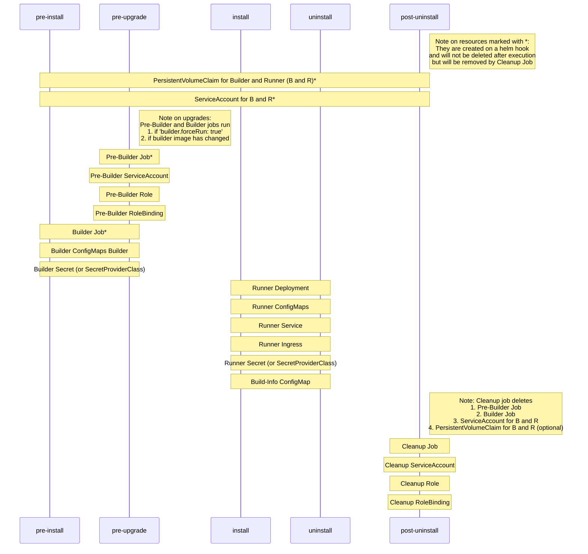

# epi

  

A Helm chart for Pharma Ledger epi (electronic product information) application

## Requirements

- [helm 3](https://helm.sh/docs/intro/install/)
- These mandatory configuration values:
  - Domain - The Domain - e.g. `epipoc`
  - Sub Domain - The Sub Domain - e.g. `epipoc.my-company`
  - Vault Domain - The Vault Domain - e.g. `vault.my-company`
  - ethadapterUrl - The Full URL of the Ethadapter including protocol and port -  e.g. "https://ethadapter.my-company.com:3000"
  - bdnsHosts - The Centrally managed and provided BDNS Hosts Config
  - buildSecretKey - A secret pass phrase for de/encrpytion of the initially generated private keys of the wallets.

## Usage

- [Here](./README.md#values) is a full list of all configuration values.
- The [values.yaml file](./values.yaml) shows the raw view of all configuration values.

## Changelog

- From 0.3.x to 0.4.x - Defaults to use epi v1.3.1
  - Removed Seedsbackup (required for epi <= 1.2.0)
  - Increased security by design: Run as non-root user, do not allow privilegeEscalation, remove all capabilites from container
  - Sensitive configuration data is stored in Kubernetes Secrets instead of ConfigMaps. Note: Support for secret injection via *CSI Secrets Driver* is in progress.
  - Option to use an existing PersistentVolumeClaim instead of creating a new one.

- From 0.2.x to 0.3.x - Default values for epi v1.2.0
  - For use with epi v1.1.2 or earlier, see comments at `config.apihub` in [values.yaml](values.yaml).
  - For SSO, see comments at `config.apihub`, `config.demiurgeMode` and `config.dsuFabricMode` in [values.yaml](values.yaml).

- From 0.1.x to 0.2.x - Technical release: Significant changes! Please uninstall old versions first! Upgrade from 0.1.x not tested and not guaranteed!
  - Uses Helm hooks for Init and Cleanup
  - Optimized Build process: SeedsBackup will only be created if the underlying Container image has changed, e.g. in case of an upgrade!
  - Readiness probe implemented. Application container is considered as *ready* after build process has been finished.
  - Value `config.ethadapterUrl` has changed from `https://ethadapter.my-company.com:3000` to `http://ethadapter.ethadapter:3000` in order to reflect changes in [ethadapter](https://github.com/PharmaLedger-IMI/helmchart-ethadapter/tree/epi-improve-build/charts/ethadapter).
  - Value `persistence.storageClassName` has changed from `gp2` to empty string `""` in order to remove pre-defined setting for AWS and to be cloud-agnostic by default.
  - Configurable sleep time between start of apihub and build process (`config.sleepTime`).
  - Configuration options for PersistentVolumeClaim
  - Configuration has been prepared for running as non-root user (commented out yet, see [values.yaml `podSecurityContext` and `securityContext`](./values.yaml)).
  - Minor optimizations at Kubernetes resources, e.g. set sizeLimit of temporary shared volume, explictly set readOnly flags at volumeMounts.

## Overall

The application consists of two docker images: A Builder image and a Runner Image.

- The *Builder Image* builds the SSApps and prepares the external volume. The builder image does not expose any http ports to the outside and does not service traffic. It will be executed by a Kubernetes Job (aka *Builder Job*) and is run once and on upgrades.
- The *Runner Image* contains the ApiHub and serves http traffic to the clients.
- In addition a docker image containing *kubectl* is required by the *Pre-Builder* and *Cleanup* jobs.

## Helm Lifecycle and Kubernetes Resources Lifetime

This helm chart uses Helm [hooks](https://helm.sh/docs/topics/charts_hooks/) in order to install, upgrade and manage the application and its resources.



## PersistentVolumeClaim

A Persistent Volume is mounted to the Builder and Runner Pod.
Therefore a PersistentVolumeClaim (PVC) is deployed by the helm chart at hook `pre-install` with various configuration options (see [values.yaml](values.yaml) at section `persistence`).
The PVC is being deleted by *Cleanup Job* on deletion of the helm chart if `persistence.deleteOnUninstall: true` (default).

If you want to reuse an existing PVC instead of creating a new one, set `persistent.existingClaim`.

## ServiceAccount

A dedicated ServiceAccount is required by the Builder Job and the Runner Pod(s) if you need to inject Secrets via *CSI Secrets Driver* instead of using Kubernetes Secrets. It is being deployed by the helm chart at hook `pre-install` and is being deleted by *Cleanup Job* on deletion of the helm chart.

## Pre-Builder Job

The *Pre-Builder job* runs on upgrades (if necessary, see *Builder Job* what "necessary" means) before the *Builder job* is being started.
It a) deletes all remaining *Builder Jobs*, its pods and waits for deletion completed and b) scales Runner deployment to zero and waits for all its pods have been deleted.

Doing so prevents any potential data integrity loss as *Builder Pod* and *Runner Pod(s)* are using the same external volume.

Note: The Job is not being deleted after execution triggered by the helm hook. This allows taking a look at the logs after execution. The Job is deleted by the *Cleanup Job* on deletion of the helm chart.

## Builder Job

The *Builder Job* runs on initial installation and on upgrades if necessary.
The term "necessary" means that it will only be executed if the builder image has changed (= new Software version) or if `builder.forceRun: true`.

The *Builder Job* starts the apihub server (`npm run server`), waits for a short (configurable, see `builder.sleepTime`) period of time and then starts the build process which will prepare data on external volume.

Note: The Job is not being deleted after execution triggered by the helm hook. This allows taking a look at the logs after execution. The Job is deleted by the *Cleanup Job* on deletion of the helm chart.

## Cleanup Job

On deletion/uninstall of the helm chart a Kubernetes Job will be deployed to delete unmanaged helm resources created by helm hooks at `pre-install` and/or `pre-upgrade`.

These resources are:

1. Pre-Builder Job - The *Pre-Builder Job* was created on pre-upgrade and will remain after its execution.
2. Builder Job - The *Builder Job* was created on pre-install/pre-upgrade and will remain after its execution.
3. PersistentVolumeClaim - In case the PersistentVolumeClaim shall not be deleted on deletion of the helm release, set `persistence.deleteOnUninstall` to `false`.
4. ServiceAccount - ServiceAccount is required by *Builder Job* and Runner in case secrets or mounted via CSI Secrets Driver.

## Installation

### Quick install with internal service of type ClusterIP

By default, this helm chart installs the Ethereum Adapter Service at an internal ClusterIP Service listening at port 3000.
This is to prevent exposing the service to the internet by accident!

It is recommended to put non-sensitive configuration values in an configuration file and pass sensitive/secret values via commandline.

1. Create configuration file, e.g. *my-config.yaml*

    ```yaml
    config:
      domain: "domain_value"
      subDomain: "subDomain_value"
      vaultDomain: "vaultDomain_value"
      ethadapterUrl: "https://ethadapter.my-company.com:3000"
      buildSecretKey: "SuperSecret"  # pragma: allowlist secret
      bdnsHosts: |-
        # ... content of the BDNS Hosts file ...

    ```

2. Install via helm to namespace `default`

    ```bash
    helm upgrade my-release-name pharmaledger-imi/epi --version=0.4.0 \
        --install \
        --values my-config.yaml \
    ```

### Expose Service via Load Balancer

In order to expose the service **directly** by an **own dedicated** Load Balancer, just **add** `service.type` with value `LoadBalancer` to your config file (in order to override the default value which is `ClusterIP`).

**Please note:** At AWS using `service.type` = `LoadBalancer` is not recommended any more, as it creates a Classic Load Balancer. Use [AWS Load Balancer Controller](https://kubernetes-sigs.github.io/aws-load-balancer-controller/v2.3/) with an ingress instead. A full sample is provided later in the docs. Using an Application Load Balancer (managed by AWS LB Controller) increases security (e.g. by using a Web Application Firewall for your http based traffic) and provides more features like hostname, pathname routing or built-in authentication mechanism via OIDC or AWS Cognito.

Configuration file *my-config.yaml*

```yaml
service:
  type: LoadBalancer

config:
  # ... config section keys and values ...
```

There are more configuration options available like customizing the port and configuring the Load Balancer via annotations (e.g. for configuring SSL Listener).

**Also note:** Annotations are very specific to your environment/cloud provider, see [Kubernetes Service Reference](https://kubernetes.io/docs/concepts/services-networking/service/#ssl-support-on-aws) for more information. For Azure, take a look [here](https://kubernetes-sigs.github.io/cloud-provider-azure/topics/loadbalancer/#loadbalancer-annotations).

Sample for AWS (SSL and listening on port 1234 instead 80 which is the default):

```yaml
service:
  type: LoadBalancer
  port: 80
  annotations:
    service.beta.kubernetes.io/aws-load-balancer-ssl-cert: arn:aws:acm:us-east-1:123456789012:certificate/12345678-1234-1234-1234-123456789012
    service.beta.kubernetes.io/aws-load-balancer-backend-protocol: http
    service.beta.kubernetes.io/aws-load-balancer-ssl-ports: "80"
    # https://docs.aws.amazon.com/de_de/elasticloadbalancing/latest/classic/elb-security-policy-table.html
    service.beta.kubernetes.io/aws-load-balancer-ssl-negotiation-policy: "ELBSecurityPolicy-TLS-1-2-2017-01"

# further config
```

### AWS Load Balancer Controller: Expose Service via Ingress

Note: You need the [AWS Load Balancer Controller](https://kubernetes-sigs.github.io/aws-load-balancer-controller/) installed and configured properly.

1. Enable ingress
2. Add *host*, *path* *`/*`* and *pathType* `ImplementationSpecific`
3. Add annotations for AWS LB Controller
4. A SSL certificate at AWS Certificate Manager (either for the hostname, here `epi.mydomain.com` or wildcard `*.mydomain.com`)

Configuration file *my-config.yaml*

```yaml
ingress:
  enabled: true
  # Let AWS LB Controller handle the ingress (default className is alb)
  # Note: Use className instead of annotation 'kubernetes.io/ingress.class' which is deprecated since 1.18
  # For Kubernetes >= 1.18 it is required to have an existing IngressClass object.
  # See: https://kubernetes.io/docs/concepts/services-networking/ingress/#deprecated-annotation
  className: alb
  hosts:
    - host: epi.mydomain.com
      # Path must be /* for ALB to match all paths
      paths:
        - path: /*
          pathType: ImplementationSpecific
  # For full list of annotations for AWS LB Controller, see https://kubernetes-sigs.github.io/aws-load-balancer-controller/v2.3/guide/ingress/annotations/
  annotations:
    # The ARN of the existing SSL Certificate at AWS Certificate Manager
    alb.ingress.kubernetes.io/certificate-arn: arn:aws:acm:REGION:ACCOUNT_ID:certificate/CERTIFICATE_ID
    # The name of the ALB group, can be used to configure a single ALB by multiple ingress objects
    alb.ingress.kubernetes.io/group.name: default
    # Specifies the HTTP path when performing health check on targets.
    alb.ingress.kubernetes.io/healthcheck-path: /
    # Specifies the port used when performing health check on targets.
    alb.ingress.kubernetes.io/healthcheck-port: traffic-port
    # Specifies the HTTP status code that should be expected when doing health checks against the specified health check path.
    alb.ingress.kubernetes.io/success-codes: "200"
    # Listen on HTTPS protocol at port 443 at the ALB
    alb.ingress.kubernetes.io/listen-ports: '[{"HTTPS":443}]'
    # Use internet facing
    alb.ingress.kubernetes.io/scheme: internet-facing
    # Use most current (as of Dec 2021) encryption ciphers
    alb.ingress.kubernetes.io/ssl-policy: ELBSecurityPolicy-TLS-1-2-Ext-2018-06
    # Use target type IP which is the case if the service type is ClusterIP
    alb.ingress.kubernetes.io/target-type: ip

config:
  # ... config section keys and values ...
```

## Additional helm options

Run `helm upgrade --helm` for full list of options.

1. Install to other namespace

    You can install into other namespace than `default` by setting the `--namespace` parameter, e.g.

    ```bash
    helm upgrade my-release-name pharmaledger-imi/epi --version=0.4.0 \
        --install \
        --namespace=my-namespace \
        --values my-config.yaml \
    ```

2. Wait until installation has finished successfully and the deployment is up and running.

    Provide the `--wait` argument and time to wait (default is 5 minutes) via `--timeout`

    ```bash
    helm upgrade my-release-name pharmaledger-imi/epi --version=0.4.0 \
        --install \
        --wait --timeout=600s \
        --values my-config.yaml \
    ```

## Potential issues

1. `Error: admission webhook "vingress.elbv2.k8s.aws" denied the request: invalid ingress class: IngressClass.networking.k8s.io "alb" not found`

    **Description:** This error only applies to Kubernetes >= 1.18 and indicates that no matching *IngressClass* object was found.

    **Solution:** Either declare an appropriate IngressClass or omit *className* and add annotation `kubernetes.io/ingress.class`

    Further information:

     - [Kubernetes IngressClass](https://kubernetes.io/docs/concepts/services-networking/ingress/#ingress-class)
     - [AWS Load Balancer controller documentation](https://kubernetes-sigs.github.io/aws-load-balancer-controller/v2.3/guide/ingress/ingress_class/)

## Helm Unittesting

[helm-unittest](https://github.com/quintush/helm-unittest) is being used for testing the output of the helm chart.
Tests can be found in [tests](./tests)

## Maintainers

| Name | Email | Url |
| ---- | ------ | --- |
| tgip-work |  | <https://github.com/tgip-work> |

## Values

*Note:* Please scroll horizontally to show more columns (e.g. description)!

| Key | Type | Default | Description |
|-----|------|---------|-------------|
| affinity | object | `{}` | Affinity for scheduling a pod. See [https://kubernetes.io/docs/concepts/scheduling-eviction/assign-pod-node/](https://kubernetes.io/docs/concepts/scheduling-eviction/assign-pod-node/) |
| builder.forceRun | bool | `false` | Boolean flag whether to enforce running the Builder even if it is not required. Useful for testing purpose. |
| builder.image.pullPolicy | string | `"Always"` | Image Pull Policy for the builder. |
| builder.image.repository | string | `"pharmaledger/epi-builder"` | The repository of the container image for the builder. |
| builder.image.sha | string | `"7756930eecac2364ba66d052839bab512dbc5f423671c13aa5e368b313f61f60"` | sha256 digest of the image for the builder. Do not add the prefix "@sha256:" Default to v1.3.1 <!-- # pragma: allowlist secret --> |
| builder.image.tag | string | `"1.3.1"` | Image tag for the builder. Default to v1.3.1 |
| builder.sleepTime | string | `"10s"` | The time to sleep between start of apihub (npm run server) and build process (npm run build-all) |
| config.apihub | string | `"{\n    \"storage\": \"../apihub-root\",\n    \"port\": 8080,\n    \"preventRateLimit\": true,\n    \"activeComponents\": [\n        \"virtualMQ\",\n        \"messaging\",\n        \"notifications\",\n        \"filesManager\",\n        \"bdns\",\n        \"bricksLedger\",\n        \"bricksFabric\",\n        \"bricking\",\n        \"anchoring\",\n        \"dsu-wizard\",\n        \"gtin-dsu-wizard\",\n        \"epi-mapping-engine\",\n        \"epi-mapping-engine-results\",\n        \"acdc-reporting\",\n        \"debugLogger\",\n        \"mq\",\n        \"secrets\",\n        \"staticServer\"\n    ],\n    \"componentsConfig\": {\n        \"epi-mapping-engine\": {\n            \"module\": \"./../../gtin-resolver\",\n            \"function\": \"getEPIMappingEngineForAPIHUB\"\n        },\n        \"epi-mapping-engine-results\": {\n            \"module\": \"./../../gtin-resolver\",\n            \"function\": \"getEPIMappingEngineMessageResults\"\n        },\n        \"acdc-reporting\": {\n            \"module\": \"./../../reporting-service/middleware\",\n            \"function\": \"Init\"\n        },\n        \"gtin-dsu-wizard\": {\n            \"module\": \"./../../gtin-dsu-wizard\"\n        },\n        \"staticServer\": {\n            \"excludedFiles\": [\n                \".*.secret\"\n            ]\n        },\n        \"bricking\": {},\n        \"anchoring\": {}\n    },\n    \"responseHeaders\": {\n        \"X-Frame-Options\": \"SAMEORIGIN\",\n        \"X-XSS-Protection\": \"1; mode=block\"\n    },\n    \"enableRequestLogger\": true,\n    \"enableJWTAuthorisation\": false,\n    \"enableOAuth\": false,\n    \"oauthJWKSEndpoint\": \"https://login.microsoftonline.com/<TODO_TENANT_ID>/discovery/v2.0/keys\",\n    \"enableLocalhostAuthorization\": false,\n    \"skipOAuth\": [\n        \"/assets\",\n        \"/bdns\",\n        \"/bundles\",\n        \"/getAuthorization\",\n        \"/external-volume/config/oauthConfig.js\"\n    ],\n    \"oauthConfig\": {\n        \"issuer\": {\n            \"issuer\": \"https://login.microsoftonline.com/<TODO_TENANT_ID>/oauth2/v2.0/\",\n            \"authorizationEndpoint\": \"https://login.microsoftonline.com/<TODO_TENANT_ID>/oauth2/v2.0/authorize\",\n            \"tokenEndpoint\": \"https://login.microsoftonline.com/<TODO_TENANT_ID>/oauth2/v2.0/token\"\n        },\n        \"client\": {\n            \"clientId\": \"<TODO_CLIENT_ID>\",\n            \"scope\": \"email offline_access openid api://<TODO_CLIENT_ID>/access_as_user\",\n            \"redirectPath\": \"https://<TODO_DNS_NAME>/?root=true\",\n            \"clientSecret\": \"<TODO_CLIENT_SECRET>\",\n            \"logoutUrl\": \"https://login.microsoftonline.com/<TODO_TENANT_ID>/oauth2/logout\",\n            \"postLogoutRedirectUrl\": \"https://<TODO_DNS_NAME>/?logout=true\"\n        },\n        \"sessionTimeout\": 1800000,\n        \"keyTTL\": 3600000,\n        \"debugLogEnabled\": false\n    },\n    \"serverAuthentication\": false\n}"` | Configuration file apihub.json. Settings: [https://docs.google.com/document/d/1mg35bb1UBUmTpL1Kt4GuZ7P0K_FMqt2Mb8B3iaDf52I/edit#heading=h.z84gh8sclah3](https://docs.google.com/document/d/1mg35bb1UBUmTpL1Kt4GuZ7P0K_FMqt2Mb8B3iaDf52I/edit#heading=h.z84gh8sclah3) <br/> For epi <= v1.1.2: Replace "module": "./../../gtin-resolver" with "module": "./../../epi-utils" <br/> For SSO (not enabled by default!): <br/> 1. "enableOAuth": true <br/> 2. "serverAuthentication": true <br/> 3. For SSO via OAuth with Azure AD, replace <TODO_*> with appropriate values.    For other identity providers (IdP) (e.g. Google, Ping, 0Auth), refer to documentation.    "redirectPath" must match the redirect URL configured at IdP <br/> 4. Add these values to "skipOAuth": "/leaflet-wallet/", "/directory-summary/", "/iframe/" |
| config.bdnsHosts | string | `"{\n  \"epipoc\": {\n      \"anchoringServices\": [\n          \"$ORIGIN\"\n      ],\n      \"notifications\": [\n          \"$ORIGIN\"\n      ]\n  },\n  \"epipoc.my-company\": {\n      \"brickStorages\": [\n          \"$ORIGIN\"\n      ],\n      \"anchoringServices\": [\n          \"$ORIGIN\"\n      ],\n      \"notifications\": [\n          \"$ORIGIN\"\n      ]\n  },\n  \"epipoc.other\": {\n      \"brickStorages\": [\n          \"https://epipoc.other-company.com\"\n      ],\n      \"anchoringServices\": [\n          \"https://epipoc.other-company.com\"\n      ],\n      \"notifications\": [\n          \"https://epipoc.other-company.com\"\n      ]\n  },\n  \"vault.my-company\": {\n      \"replicas\": [],\n      \"brickStorages\": [\n          \"$ORIGIN\"\n      ],\n      \"anchoringServices\": [\n          \"$ORIGIN\"\n      ],\n      \"notifications\": [\n          \"$ORIGIN\"\n      ]\n  }\n}"` | Centrally managed and provided BDNS Hosts Config |
| config.buildSecretKey | string | `""` | Secret Pass Phrase for de/encrypting private keys for application wallets created by builder. |
| config.demiurgeMode | string | `"dev-secure"` | For SSO, set to "sso-pin" |
| config.domain | string | `"epipoc"` | The Domain, e.g. "epipoc" |
| config.dsuFabricMode | string | `"dev-secure"` | For SSO, set to "sso-direct" |
| config.ethadapterUrl | string | `"http://ethadapter.ethadapter:3000"` | The Full URL of the Ethadapter including protocol and port, e.g. "https://ethadapter.my-company.com:3000" |
| config.overrides.apihubJson | string | `""` | Option to explitly set the apihub.json instead of using the default from [https://github.com/PharmaLedger-IMI/epi-workspace/blob/v1.3.1/apihub-root/external-volume/config/apihub.json](https://github.com/PharmaLedger-IMI/epi-workspace/blob/v1.3.1/apihub-root/external-volume/config/apihub.json). Note: If secretProviderClass.enabled=true, then this value is ignored as it is used/mounted from Secret Vault. |
| config.overrides.demiurgeEnvironmentJs | string | `""` | Option to explictly override the environment.js file used for demiurge-wallet instead of using the predefined template. Note: Usually not required |
| config.overrides.domainConfigJson | string | `""` | Option to explictly override the config.json used for the domain instead of using the predefined template. Note: Usually not required |
| config.overrides.dsuExplorerEnvironmentJs | string | `""` | Option to explictly override the environment.js file used for DSU Explorer Wallet instead of using the predefined template. Note: Usually not required |
| config.overrides.dsuFabricEnvironmentJs | string | `""` | Option to explictly override the environment.js file used for DSU Fabric Wallet instead of using the predefined template. Note: Usually not required |
| config.overrides.leafletEnvironmentJs | string | `""` | Option to explictly override the environment.js file used for Leaflet Wallet instead of using the predefined template. Note: Usually not required |
| config.overrides.subDomainConfigJson | string | `""` | Option to explictly override the config.json used for the subDomain instead of using the predefined template. Note: Usually not required |
| config.overrides.vaultDomainConfigJson | string | `""` | Option to explictly override the config.json used for the vaultDomain instead of using the predefined template. Note: Usually not required |
| config.subDomain | string | `"epipoc.my-company"` | The Subdomain, should be domain.company, e.g. epipoc.my-company |
| config.vaultDomain | string | `"vault.my-company"` | The Vault domain, should be vault.company, e.g. vault.my-company |
| deploymentStrategy | object | `{"type":"Recreate"}` | The strategy of the deployment. Defaults to type: Recreate as a PVC is bound to it. See `kubectl explain deployment.spec.strategy` for more and [https://kubernetes.io/docs/concepts/workloads/controllers/deployment/#strategy](https://kubernetes.io/docs/concepts/workloads/controllers/deployment/#strategy) |
| fullnameOverride | string | `""` | fullnameOverride completely replaces the generated name. From [https://stackoverflow.com/questions/63838705/what-is-the-difference-between-fullnameoverride-and-nameoverride-in-helm](https://stackoverflow.com/questions/63838705/what-is-the-difference-between-fullnameoverride-and-nameoverride-in-helm) |
| imagePullSecrets | list | `[]` | Secret(s) for pulling an container image from a private registry. See [https://kubernetes.io/docs/tasks/configure-pod-container/pull-image-private-registry/](https://kubernetes.io/docs/tasks/configure-pod-container/pull-image-private-registry/) |
| ingress.annotations | object | `{}` | Ingress annotations. <br/> For AWS LB Controller, see [https://kubernetes-sigs.github.io/aws-load-balancer-controller/v2.3/guide/ingress/annotations/](https://kubernetes-sigs.github.io/aws-load-balancer-controller/v2.3/guide/ingress/annotations/) <br/> For Azure Application Gateway Ingress Controller, see [https://azure.github.io/application-gateway-kubernetes-ingress/annotations/](https://azure.github.io/application-gateway-kubernetes-ingress/annotations/) <br/> For NGINX Ingress Controller, see [https://kubernetes.github.io/ingress-nginx/user-guide/nginx-configuration/annotations/](https://kubernetes.github.io/ingress-nginx/user-guide/nginx-configuration/annotations/) <br/> For Traefik Ingress Controller, see [https://doc.traefik.io/traefik/routing/providers/kubernetes-ingress/#annotations](https://doc.traefik.io/traefik/routing/providers/kubernetes-ingress/#annotations) |
| ingress.className | string | `""` | The className specifies the IngressClass object which is responsible for that class. See [https://kubernetes.io/docs/concepts/services-networking/ingress/#ingress-class](https://kubernetes.io/docs/concepts/services-networking/ingress/#ingress-class) <br/> For Kubernetes >= 1.18 it is required to have an existing IngressClass object. If IngressClass object does not exists, omit className and add the deprecated annotation 'kubernetes.io/ingress.class' instead. <br/> For Kubernetes < 1.18 either use className or annotation 'kubernetes.io/ingress.class'. |
| ingress.enabled | bool | `false` | Whether to create ingress or not. <br/> Note: For ingress an Ingress Controller (e.g. AWS LB Controller, NGINX Ingress Controller, Traefik, ...) is required and service.type should be ClusterIP or NodePort depending on your configuration |
| ingress.hosts | list | `[{"host":"epi.some-pharma-company.com","paths":[{"path":"/","pathType":"ImplementationSpecific"}]}]` | A list of hostnames and path(s) to listen at the Ingress Controller |
| ingress.hosts[0].host | string | `"epi.some-pharma-company.com"` | The FQDN/hostname |
| ingress.hosts[0].paths[0].path | string | `"/"` | The Ingress Path. See [https://kubernetes.io/docs/concepts/services-networking/ingress/#examples](https://kubernetes.io/docs/concepts/services-networking/ingress/#examples) <br/> Note: For Ingress Controllers like AWS LB Controller see their specific documentation. |
| ingress.hosts[0].paths[0].pathType | string | `"ImplementationSpecific"` | The type of path. This value is required since Kubernetes 1.18. <br/> For Ingress Controllers like AWS LB Controller or Traefik it is usually required to set its value to ImplementationSpecific See [https://kubernetes.io/docs/concepts/services-networking/ingress/#path-types](https://kubernetes.io/docs/concepts/services-networking/ingress/#path-types) and [https://kubernetes.io/blog/2020/04/02/improvements-to-the-ingress-api-in-kubernetes-1.18/](https://kubernetes.io/blog/2020/04/02/improvements-to-the-ingress-api-in-kubernetes-1.18/) |
| ingress.tls | list | `[]` |  |
| kubectl.image.pullPolicy | string | `"IfNotPresent"` | Image Pull Policy |
| kubectl.image.repository | string | `"bitnami/kubectl"` | The repository of the container image containing kubectl |
| kubectl.image.sha | string | `"f9814e1d2f1be7f7f09addd1d877090fe457d5b66ca2dcf9a311cf1e67168590"` | sha256 digest of the image. Do not add the prefix "@sha256:" <br/> Defaults to image digest for "bitnami/kubectl:1.21.8", see [https://hub.docker.com/layers/kubectl/bitnami/kubectl/1.21.8/images/sha256-f9814e1d2f1be7f7f09addd1d877090fe457d5b66ca2dcf9a311cf1e67168590?context=explore](https://hub.docker.com/layers/kubectl/bitnami/kubectl/1.21.8/images/sha256-f9814e1d2f1be7f7f09addd1d877090fe457d5b66ca2dcf9a311cf1e67168590?context=explore) <!-- # pragma: allowlist secret --> |
| kubectl.image.tag | string | `"1.21.8"` | The Tag of the image containing kubectl. Minor Version should match to your Kubernetes Cluster Version. |
| kubectl.podSecurityContext | object | `{"fsGroup":65534,"runAsGroup":65534,"runAsUser":65534,"seccompProfile":{"type":"RuntimeDefault"}}` | Security Context for the pod running kubectl. See [https://kubernetes.io/docs/tasks/configure-pod-container/security-context/#set-the-security-context-for-a-pod](https://kubernetes.io/docs/tasks/configure-pod-container/security-context/#set-the-security-context-for-a-pod) and [https://kubernetes.io/docs/tutorials/security/seccomp/](https://kubernetes.io/docs/tutorials/security/seccomp/) |
| kubectl.securityContext | object | `{"allowPrivilegeEscalation":false,"capabilities":{"drop":["ALL"]},"readOnlyRootFilesystem":true,"runAsGroup":65534,"runAsNonRoot":true,"runAsUser":65534}` | Security Context for the container running kubectl See [https://kubernetes.io/docs/tasks/configure-pod-container/security-context/#set-the-security-context-for-a-container](https://kubernetes.io/docs/tasks/configure-pod-container/security-context/#set-the-security-context-for-a-container) |
| livenessProbe | object | `{"failureThreshold":3,"httpGet":{"httpHeaders":[{"name":"Host","value":"localhost"}],"path":"/","port":"http"},"initialDelaySeconds":10,"periodSeconds":10,"successThreshold":1,"timeoutSeconds":1}` | Liveness probe. See [https://kubernetes.io/docs/tasks/configure-pod-container/configure-liveness-readiness-startup-probes/](https://kubernetes.io/docs/tasks/configure-pod-container/configure-liveness-readiness-startup-probes/) |
| nameOverride | string | `""` | nameOverride replaces the name of the chart in the Chart.yaml file, when this is used to construct Kubernetes object names. From [https://stackoverflow.com/questions/63838705/what-is-the-difference-between-fullnameoverride-and-nameoverride-in-helm](https://stackoverflow.com/questions/63838705/what-is-the-difference-between-fullnameoverride-and-nameoverride-in-helm) |
| namespaceOverride | string | `""` | Override the deployment namespace. Very useful for multi-namespace deployments in combined charts |
| nodeSelector | object | `{}` | Node Selectors in order to assign pods to certain nodes. See [https://kubernetes.io/docs/concepts/scheduling-eviction/assign-pod-node/](https://kubernetes.io/docs/concepts/scheduling-eviction/assign-pod-node/) |
| persistence.accessModes | list | `["ReadWriteOnce"]` | AccessModes for the new PVC. See [https://kubernetes.io/docs/concepts/storage/persistent-volumes/#access-modes](https://kubernetes.io/docs/concepts/storage/persistent-volumes/#access-modes) |
| persistence.dataSource | object | `{}` | DataSource option for cloning an existing volume or creating from a snapshot for a new PVC. See [values.yaml](values.yaml) for more details. |
| persistence.deleteOnUninstall | bool | `true` | Boolean flag whether to delete the (new) PVC on uninstall or not. |
| persistence.existingClaim | string | `""` | The name of an existing PVC to use instead of creating a new one. |
| persistence.finalizers | list | `["kubernetes.io/pvc-protection"]` | Finalizers for the new PVC. See [https://kubernetes.io/docs/concepts/storage/persistent-volumes/#storage-object-in-use-protection](https://kubernetes.io/docs/concepts/storage/persistent-volumes/#storage-object-in-use-protection) |
| persistence.selectorLabels | object | `{}` | Selector Labels for the new PVC. See [https://kubernetes.io/docs/concepts/storage/persistent-volumes/#selector](https://kubernetes.io/docs/concepts/storage/persistent-volumes/#selector) |
| persistence.size | string | `"20Gi"` | Size of the volume for the new PVC |
| persistence.storageClassName | string | `""` | Name of the storage class for the new PVC. If empty or not set then storage class will not be set - which means that the default storage class will be used. |
| podAnnotations | object | `{}` | Annotations added to the pod |
| podSecurityContext | object | `{"fsGroup":1000,"runAsGroup":1000,"runAsUser":1000,"seccompProfile":{"type":"RuntimeDefault"}}` | Security Context for the pod. See [https://kubernetes.io/docs/tasks/configure-pod-container/security-context/#set-the-security-context-for-a-pod](https://kubernetes.io/docs/tasks/configure-pod-container/security-context/#set-the-security-context-for-a-pod) |
| podSecurityContext.seccompProfile | object | `{"type":"RuntimeDefault"}` | The SecComp configuration. [https://kubernetes.io/docs/tutorials/security/seccomp/](https://kubernetes.io/docs/tutorials/security/seccomp/) |
| readinessProbe | object | `{"failureThreshold":3,"httpGet":{"httpHeaders":[{"name":"Host","value":"localhost"}],"path":"/","port":"http"},"initialDelaySeconds":10,"periodSeconds":10,"successThreshold":1,"timeoutSeconds":1}` | Readiness probe. See [https://kubernetes.io/docs/tasks/configure-pod-container/configure-liveness-readiness-startup-probes/](https://kubernetes.io/docs/tasks/configure-pod-container/configure-liveness-readiness-startup-probes/) |
| replicaCount | int | `1` | The number of replicas if autoscaling is false |
| resources | object | `{}` | Resource constraints for the container |
| runner.image.pullPolicy | string | `"Always"` | Image Pull Policy for the runner |
| runner.image.repository | string | `"pharmaledger/epi-runner"` | The repository of the container image for the runner |
| runner.image.sha | string | `"6a0dbf0a2d54490235b303f97cbe5d833e6f1a69ac306e362a6ba72ef9c9c38a"` | sha256 digest of the image. Do not add the prefix "@sha256:" Default to v1.3.1 <!-- # pragma: allowlist secret --> |
| runner.image.tag | string | `"1.3.1"` | Overrides the image tag whose default is the chart appVersion. Default to v1.3.1 |
| secretProviderClass.apiVersion | string | `"secrets-store.csi.x-k8s.io/v1"` | API Version of the SecretProviderClass |
| secretProviderClass.enabled | bool | `false` | Whether to use CSI Secrets Store (e.g. Azure Key Vault) instead of "traditional" Kubernetes Secret. NOTE: DO ENABLE, NOT TESTED YET! |
| secretProviderClass.spec | object | `{}` | Spec for the SecretProviderClass. Note: The orgAccountJson must be mounted as objectAlias orgAccountJson |
| securityContext | object | `{"allowPrivilegeEscalation":false,"capabilities":{"drop":["ALL"]},"readOnlyRootFilesystem":false,"runAsGroup":1000,"runAsNonRoot":true,"runAsUser":1000}` | Security Context for the application container See [https://kubernetes.io/docs/tasks/configure-pod-container/security-context/#set-the-security-context-for-a-container](https://kubernetes.io/docs/tasks/configure-pod-container/security-context/#set-the-security-context-for-a-container) |
| service.annotations | object | `{}` | Annotations for the service. See AWS, see [https://kubernetes.io/docs/concepts/services-networking/service/#ssl-support-on-aws](https://kubernetes.io/docs/concepts/services-networking/service/#ssl-support-on-aws) For Azure, see [https://kubernetes-sigs.github.io/cloud-provider-azure/topics/loadbalancer/#loadbalancer-annotations](https://kubernetes-sigs.github.io/cloud-provider-azure/topics/loadbalancer/#loadbalancer-annotations) |
| service.port | int | `80` | Port where the service will be exposed |
| service.type | string | `"ClusterIP"` | Either ClusterIP, NodePort or LoadBalancer. See [https://kubernetes.io/docs/concepts/services-networking/service/](https://kubernetes.io/docs/concepts/services-networking/service/) |
| serviceAccount.annotations | object | `{}` | Annotations to add to the service account |
| serviceAccount.automountServiceAccountToken | bool | `false` | Whether automounting API credentials for a service account is enabled or not. See [https://docs.bridgecrew.io/docs/bc_k8s_35](https://docs.bridgecrew.io/docs/bc_k8s_35) |
| serviceAccount.create | bool | `false` | Specifies whether a service account should be created which is used by builder and runner. |
| serviceAccount.name | string | `""` | The name of the service account to use. If not set and create is true, a name is generated using the fullname template |
| tolerations | list | `[]` | Tolerations for scheduling a pod. See [https://kubernetes.io/docs/concepts/scheduling-eviction/taint-and-toleration/](https://kubernetes.io/docs/concepts/scheduling-eviction/taint-and-toleration/) |

----------------------------------------------
Autogenerated from chart metadata using [helm-docs v1.8.1](https://github.com/norwoodj/helm-docs/releases/v1.8.1)
