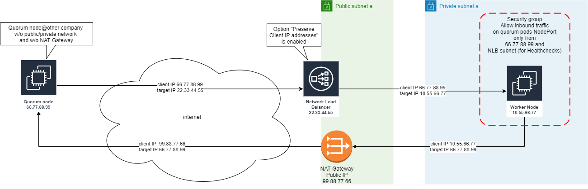

# Quorum node on AWS behind a Network Load Balancer

## TL;DR

Sample solutions provided in directories

- [helm-chart](helm-chart/README.md)
- [kubernetes-deployment](kubernetes-deployment/README.md)

## Introduction

Addresses the issues of:

- Static public IP address for a Quorum node
- Restrict inbound traffic to a Quorum node only from other Quorum nodes of the network (IP whitelist)

Applicable for most Kubernetes installations at AWS with a typical public and private subnet approach:

- VPC with public subnets and private subnets for each availability zone (at least 2).
- Internet gateway attached to VPC
- Kubernetes Worker nodes placed into private subnets not directly accessible from the internet
- NAT gateways or NAT instances located in public subnets allowing outbound traffic to the internet from resources in private subnets.
- Inbound traffic from internet is forwarded by Load Balancers in public subnets to the private resources.

## Problem description

1. Quorum network heavily relies on addressing nodes by IP address
2. Quorum does DNS Lookup only at startup. Thus, if IP address of a node changes during runtime (failover or infrastructure change), other nodes won't get aware of it and keep on trying to connect to old IP address.
3. The AWS Classic Elastic Load Balancer (ELB) does not provide *static* IP addresses. The ELB public IP addresses may change over time (e.g. due to internal failovers/replacements in AWS managed infrastructure). In this case, same problem: Quorum nodes continue connecting to old IP address.
4. An AWS Elastic IP address (EIP) - which is static - **cannot** be associated with an ELB. Only AWS Network Load Balancer (NLB) supports EIP.
5. By default, NLB nodes are placed into all public subnets. Each NLB node has its own IP address. As described above, we only need one IP address not an IP address for each public subnet (= availability zone).
6. NLB does not have a security group. Inbound traffic cannot be restricted at NLB level. Thus the security group of the Kubernetes worker node (or pod) has to be modified to restrict inbound traffic to the Kubernetes service for the Quorum pod.
7. Depending on NLBs instance or IP mode, the NLB does not forward the client IP address (= the public IP address of the other Quorum node) but is using its own internal IP address from the public subnet CIDR range (e.g. 10.4.5.6 instead of 52.34.89.123). This means inbound traffic at the worker nodes security group level cannot be restricted to other Quorum nodes unless NLB preserves the client (=sender) IP address.
8. Quorum node requires persistent block storage (EBS volume). An EBS volume is bound to an availability zone and cannot be used across different availability zone.
9. A pod within Kubernetes with a persistent volume (EBS) is initially deployed on any worker node (with resources available). Thus, more or less the availability zone of the EBS volume is chosen randomly; this means the pod will be bound to this availability zone indefinetely.

## Solution

1. Deploy Network Load Balancer in one/single public subnet and associated with an EIP => Single and static IP address
2. Enable `Preserve client IP addresses` option at NLB target group => Allows restricting inbound traffic at security group for worker node (or pod).
3. Configure security group for worker node (or pod) to restrict inbound traffic from other Quorum nodes in the same network.
4. Add a zone affinity to the Quorum pod deployment in order to deploy the pod in the same availability zone as NLB.

We do not want to configure AWS resources manually, let Kubernetes do it for us!
Working solutions can be found here

- [helm-chart](helm-chart/README.md)
- [kubernetes-deployment](kubernetes-deployment/README.md)

## Additional security measures

Not handled here:

- Add Network Access Control List (NACL) to private subnet allowing inbound traffic only from NLBs public subnet and from other Quorum nodes public IP addresses.

## Known Issues

- Annotations not applied/visible in Kubernetes and/or errors on deploy via kubectl like `error: unable to decode "service.yaml": resource.metadataOnlyObject.ObjectMeta: v1.ObjectMeta.Annotations: ReadString: expects " or n, but found f, error found in #10 byte of ...|enabled":false,"serv|..., bigger context ...|load-balancer-cross-zone-load-balancing-enabled":false,"service.beta.kubernetes.io/aws-load-balancer|...`
  
  **Solution:** Check if annotation values are valid YAML. E.g. Invalid: "myannotation": false  - Valid: "myannotation": "false"
