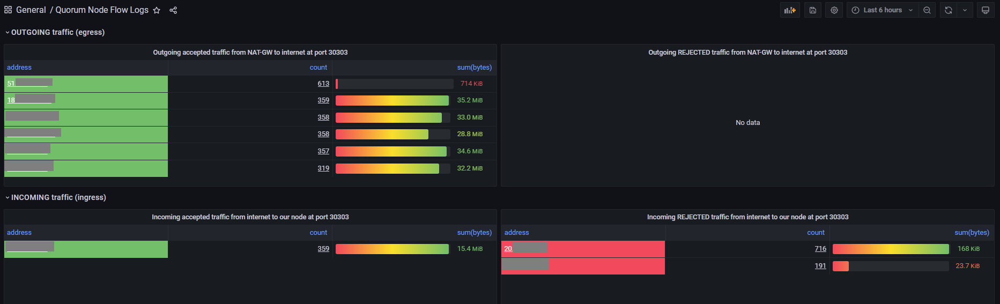

# Monitoring

Prometheus is being used to scrape the metrics from the pods metrics endpoint and to store them in a timeseries database.
Grafana is being used for visualization of the metrics. Grafana and Prometheus can also be used for alerting.
On Kubernetes, it is easy to install both components via helm charts.

- [Prometheus Helm Chart](https://github.com/prometheus-community/helm-charts/blob/main/charts/prometheus/README.md)
- [Grafana Helm Chart](https://github.com/grafana/helm-charts/blob/main/charts/grafana/README.md)

For details, take a look at [Kubernetes monitoring with Prometheus, the ultimate guide](https://sysdig.com/blog/kubernetes-monitoring-prometheus/).

## GoQuorum Metrics

The Quorum node provides several metrics by default in [Prometheus Metrics Format](https://github.com/prometheus/docs/blob/main/content/docs/instrumenting/exposition_formats.md). These metrics can be queried at Port `9545` at path `/debug/metrics/prometheus`. The pod configuration itself provides [appropriate annotations](https://www.weave.works/docs/cloud/latest/tasks/monitor/configuration-k8s/#per-pod-prometheus-annotations) for Prometheus to scrape these metrics. You can configure the metrics behaviour via the configuration section `quorum.metrics`.

In Grafana, install the [GoQuorum Overview Community Dashboard](https://grafana.com/grafana/dashboards/14360) to monitor Quorum Node metrics like *number of peers*. For automated notification on certain events, you can define alarms, e.g. in case number of peers has fallen below s treshold.

## Peers

Also, you may want to have an overview of peer node connections from and to your node.
There are no metrics by default, thus a workaround is needed.

### AWS

At AWS, you can query the VPC flow logs to retrieve the required information:

1. Activate VPC Flow logs to Cloudwatch
2. Provide IAM Role for Grafanas Kubernetes Service Account that allows Grafana to query Cloudmatch logs and configure Grafana (via helm chart) accordingly. See [here](https://grafana.com/docs/grafana/latest/datasources/aws-cloudwatch/) for the required permissions.
3. In Grafana install the [AWS CloudWatch data source](https://grafana.com/docs/grafana/latest/datasources/aws-cloudwatch/).
4. Take a look at [this Grafana dashboard definition](grafana_aws_vpc_flow_logs.json). It analyzes the traffic flow and assumes that the LoadBalancer is located in public subnets and the quorum node in a private subnet.
    1. Replace all `todo` with appropriate values.
    2. Import the dashboard into Grafana.

    

## Links

- [Kubernetes monitoring with Prometheus, the ultimate guide](https://sysdig.com/blog/kubernetes-monitoring-prometheus/)
- [How to monitor the Geth (Quorum) node in under 5 minutes](https://www.netdata.cloud/blog/how-to-monitor-the-geth-node-in-under-5-minutes/)
- [Geth Inferface Metrics](https://geth.ethereum.org/docs/interface/metrics)
