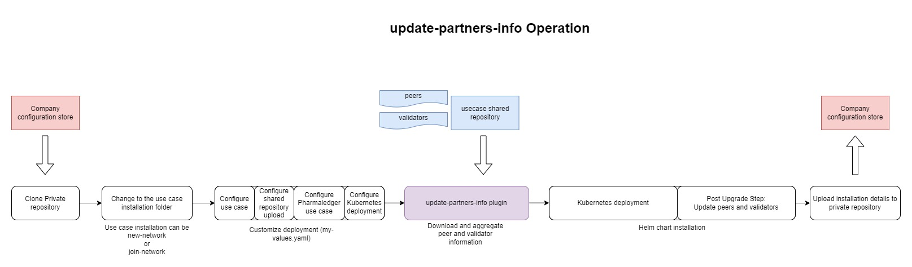

## updatePartnersInfo use case

Update peers/validators information in the Quorum Blockchain Node. 

Chart name: quorum-node <br/>
Plugin : update-partners-info

### Update Partners Information in a deployed Quorum node



#### Step 1: Clone your private config repository in the folder "private_configs"


1. After the repository was cloned, change the directory to the "private_configs" folder
```shell
cd private_configs
```
2. Change to the folder which represent your installation, like "network_name/charts/quorum-node"
```shell
cd network_name/charts/quorum-node
```

### Step 2: Update the helm charts

1. Execute:
```shell
helm repo update pharmaledger-imi
```

#### Step 3: Adjust private_configs/network_name/charts/quorum-node/my-values.yaml


### Enable the use case
Example :
```yaml
use_case:
   updatePartnersInfo:
      enabled: true
      peers: [
            company-1,
            company-2,
            company-3
      ]
```

### Configure shared repository
Example
```yaml
git_shared_configuration:
  # -- shared github repository name eg. PharmaLedger-IMI/epi-shared-configuration
  repository_name: "PharmaLedger-IMI/epi-shared-configuration"
  # -- github read-write token
  read_write_token: "git hub read write token"
```


#### Step 4: Install the helm chart

1. Use the _pl-plugin_ plugin to download and aggregate the quorum node connection details and network validators list. 
   The execution of the plugin will produce:
   1. _update-partners-info.plugin.json_ file that will contain all the generated information, like the list of all validators and enode connections. The json file will be used by the helm charts.
   
```shell
helm pl-plugin --update-partners-info -i ./values.yaml -o .
```

2. Install the helm chart 
<br/><br/>***Note: Chose the upgrade path based on your initial use case***<br/><br/>
   
2.1 Upgraded installation is of use case type **new-network**
  
```shell
helm upgrade --install qn-0 pharmaledger-imi/quorum-node -f ./my-values.yaml --set-file use_case.newNetwork.plugin_data_common=./new-network.plugin.json,use_case.newNetwork.plugin_data_secrets=./new-network.plugin.secrets.json,use_case.updatePartnersInfo.plugin_data_common=./update-partners-info.plugin.json
```

2.2 Upgraded installation is of use case type **join-network**

```shell
helm upgrade --install qn-0 pharmaledger-imi/quorum-node -f ./my-values.yaml --set-file use_case.joinNetwork.plugin_data_common=./join-network.plugin.json,use_case.joinNetwork.plugin_data_secrets=./join-network.plugin.secrets.json,use_case.updatePartnersInfo.plugin_data_common=./update-partners-info.plugin.json
```

The execution of the chart will update all the peers and propose all the peers as validators.

#### Step 5: Backup your installation and private information

Upload to your private repository all the data located in the folder _private_configs/network_name/charts/quorum-node_


